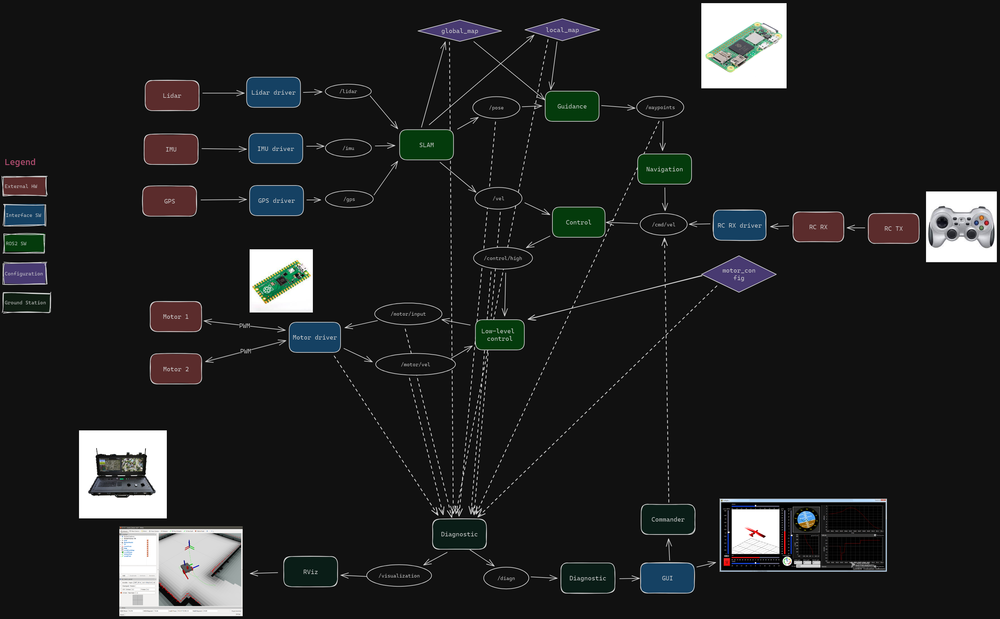
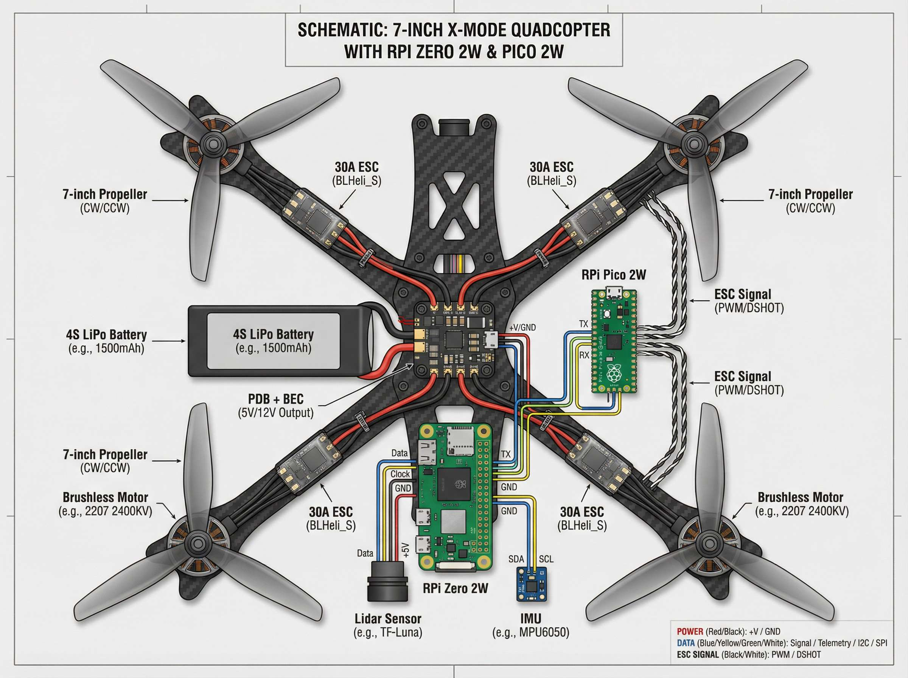
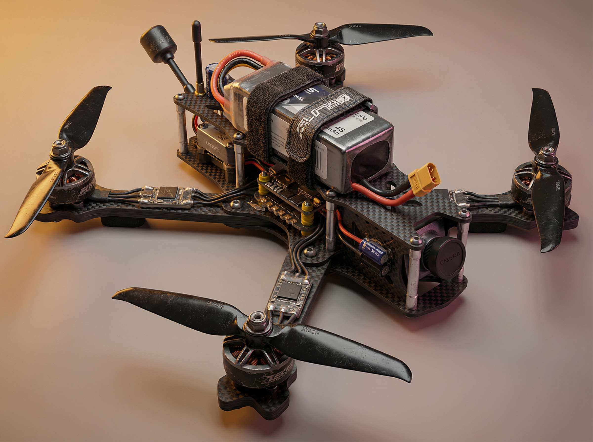

VentuRobotics is a private robotics project I co-founded and actively contribute to, focused on developing a scalable, modular software framework for multi-platform autonomy across ground (UGV), aerial (UAV), and underwater (UUV) vehicles. Hosted on GitHub (github.com/VentuRobotics), the project emphasizes reusable components, versioned interfaces, and safe deployment paths to accelerate prototyping and production in extreme environments – from planetary exploration analogs to industrial inspection fleets.

Inspired by my professional experience in confidential autonomy programs, VentuRobotics started as a side project to democratize best practices in ROS2-based architectures, making it easier for indie developers, startups, and academic teams to build cross-domain robotic systems without starting from scratch. The repo includes reference implementations, simulation environments, and tooling that I've battle-tested in real-world scenarios.

Key technical contributions as lead architect and maintainer:

- Core ROS2 framework with pluggable modules for SLAM, GNC (guidance, navigation, control), and sensor fusion, supporting seamless hardware swaps (e.g., LiDAR to sonar transitions for UUVs).
- Embedded firmware templates and driver integrations optimized for real-time Linux and NVIDIA Jetson edge compute.
- DevOps pipeline using Bazel/CMake for builds, Docker/OCI for containerization, and Ansible for fleet orchestration – enabling zero-downtime updates in the field.
- Simulation suite in Gazebo/Unity with multi-robot scenarios, achieving >95% sim-to-real fidelity for cooperative missions (e.g., UAV scouting for UGV excavation).
- Community-driven extensions: ML integration hooks (PyTorch for perception) and testing harnesses (GoogleTest + HIL replay) that enforce MISRA-inspired safety on critical paths.

The project has garnered 150+ stars and 30+ forks since launch, with contributions from global collaborators. It's my go-to playground for experimenting with emerging tech like C++20 coroutines for async sensor handling and Kafka-based telemetry streaming – directly informing my day job.

Tech stack I own day-to-day:
C++20 • ROS2 Humble/Iron • Python 3.11 • Bazel • Docker • Ansible • GitLab CI/CD • NVIDIA JetPack • PX4/ArduSub integration • Real-time Linux • CANopen/EtherCAT

VentuRobotics bridges my academic roots (DRAFT PoliTO challenges) with production-scale work. Check it out at github.com/VentuRobotics!

*Project high-level schema.*

*Firsts drone prototype.*
